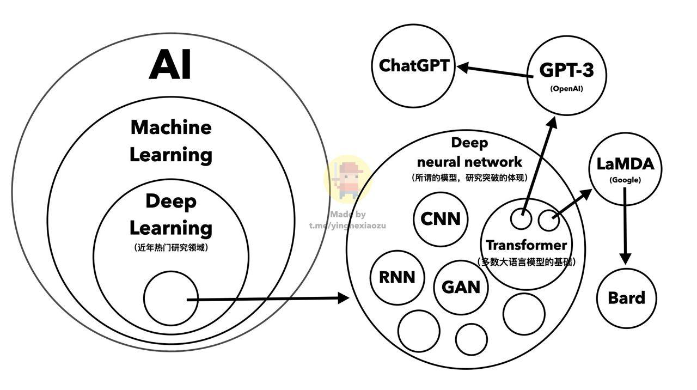

> Thoughts and notes on ChatGPT and beyond 🚀
>> I'd intentionally limit the content and the links here, not just because I'm a newbie to Machine Learning but also the very act of keeping a ton of links do nothing to help you learn.

## *Read*

### Relation between AI, ML, Dl and LLM

  

### [What *ChatGPT* is Really All About](https://twitter.com/thecat/status/1599918939081179136)

> "Language models don't actually understand the world, they understand relationships between lexemes, they aren't intelligent in the same way that a motion picture isn't really moving."
>
> Mine: *The lexemes were produced by humans. Suppose all the world knowledge were stored in a library, ChatGPT is the one who read them all and give you <small>(at least)</small> a reasonable gist of the book.*
>> Update on Feb 22, 2023: mine is oversimplified and stupid

## To Read

### LLMs like *ChatGPT*

#### What Is It, Philosophically Speaking

- [ChatGPT Is a Blurry JPEG of the Web | annotated by Eric](https://readwise.io/reader/shared/01gry4pcabx8kh4k1pkpf2e2pe/)

#### What Is It, Technically Speaking

- [Yann LeCun @ylecun - "Large Language Model is an off-ramp."](https://twitter.com/ylecun/status/1621805604900585472) <small>(people seemed to be so triggered which is so fucking weird)</small>
- [通向AGI之路：大型语言模型（LLM）技术精要](https://zhuanlan.zhihu.com/p/597586623)

#### How It Works

> Implement one by yourself: [karpathy/nanoGPT](https://github.com/karpathy/nanoGPT)

- [ChatGPT Explained: A Normie's Guide To How It Works](https://www.jonstokes.com/p/chatgpt-explained-a-guide-for-normies)
- [Everything I Understand about ChatGPT](https://gist.github.com/veekaybee/6f8885e9906aa9c5408ebe5c7e870698)
- [What is ChatGPT doing...and why does it work?](https://www.youtube.com/watch?v=flXrLGPY3SU)
- [How GPT3 Works - Visualizations and Animations](https://jalammar.github.io/how-gpt3-works-visualizations-animations/)
- [Helen Toner @hlntnr - Tentacle Monster and ChatGPT](https://twitter.com/hlntnr/status/1632030583462285312)

#### Ethics

- [Is it OK to generate parts of a research paper using a large language model such as ChatGPT?](https://academia.stackexchange.com/questions/191197/is-it-ok-to-generate-parts-of-a-research-paper-using-a-large-language-model-such)
- [An AI porn industry is emerging through Stable Diffusion | Hacker News](https://news.ycombinator.com/item?id=34845370)

#### Consciousness / Sentience

- [Sydney (Bing GPT) is scarily similar to Samantha from the movie "Her" (2013) | /r/Singularity](https://old.reddit.com/r/singularity/comments/113016w/sydney_bing_gpt_is_scarily_similar_to_samantha/)
- [Are Large Language Models sentient? What do we really mean when we ask that question? | /r/Futurology](https://old.reddit.com/r/Futurology/comments/vb1dt2/are_large_language_models_sentient_what_do_we/)
- [[D] Do large language models understand us? : MachineLearning](https://old.reddit.com/r/MachineLearning/comments/riqxrq/d_do_large_language_models_understand_us/)

#### Beyond

- [Microsoft 与 Google 在「搜索」上的博弈 | 一亩三分地](https://www.1point3acres.com/bbs/thread-968018-1-1.html)
- [LLM Powered Assistants for Complex Interfaces - Nick Arner](https://nickarner.com/notes/llm-powered-assistants-for-complex-interfaces-february-26-2023/)
- [Stanford Webinar - GPT-3 & Beyond](https://www.youtube.com/watch?v=-lnHHWRCDGk)
- [Examining Emergent Abilities in Large Language Models](https://hai.stanford.edu/news/examining-emergent-abilities-large-language-models)
- [Emergent Abilities of Large Language Models](https://www.assemblyai.com/blog/emergent-abilities-of-large-language-models/)

#### Uncategorized

- [A ChatGPT Story about ChatGPT Doom](https://www.lesswrong.com/posts/R4qcDeFdE2QzHLBFQ/a-chatgpt-story-about-chatgpt-doom)
- [CheatGPT on Hacker News](https://news.ycombinator.com/item?id=34871903) <small>(Both the *comments* and *articles* were of high quality)</small>

-----

> Note to self and the others: it was powered by *ChatGPT* as of the article was written <small>(timestamp: Feb 18, 2023)</small>. Also, don't mind the titles, the discussions under this post are of extremely high quality
