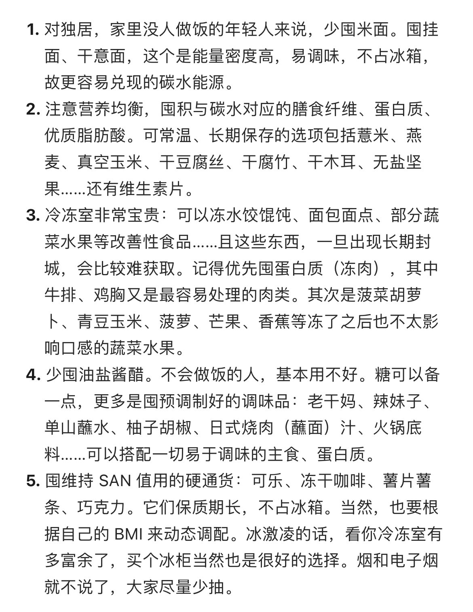

> It varies a ton depending what your objectives are
<!-- toc -->

> What is this <small>([wikipedia](https://en.wikipedia.org/wiki/Survivalism))</small>
>> Survivalism is a social movement of individuals or groups (called survivalists or preppers) who proactively prepare for emergencies, such as natural disasters, as well as other disasters causing disruption to social order (that is, civil disorder) caused by political or economic crises.

## Information Hub

- [/r/Preppers/](https://old.reddit.com/r/preppers/) 👉 *Better safe than sorry*
- [/r/SelfReliance/](https://old.reddit.com/r/selfreliance/) 👉 *Reliance on one's own powers and resources*
- [/r/PrepperIntel/](https://old.reddit.com/r/PrepperIntel/) 👉 *Intelligence reports from preppers around the world*
- [/r/Frugal/](https://old.reddit.com/r/Frugal/) 👉 *Frugal Living: Waste Less, Gain More!*
- [隔离食用手册](https://cook.yunyoujun.cn/)

## Specifics

### Guide in Text

- [How to prep for "boring" disasters? : preppers](https://old.reddit.com/r/preppers/comments/n0p76n/how_to_prep_for_boring_disasters/)

### Guide in Picture

- Methodology of Preparing for Lockdown

  > 
