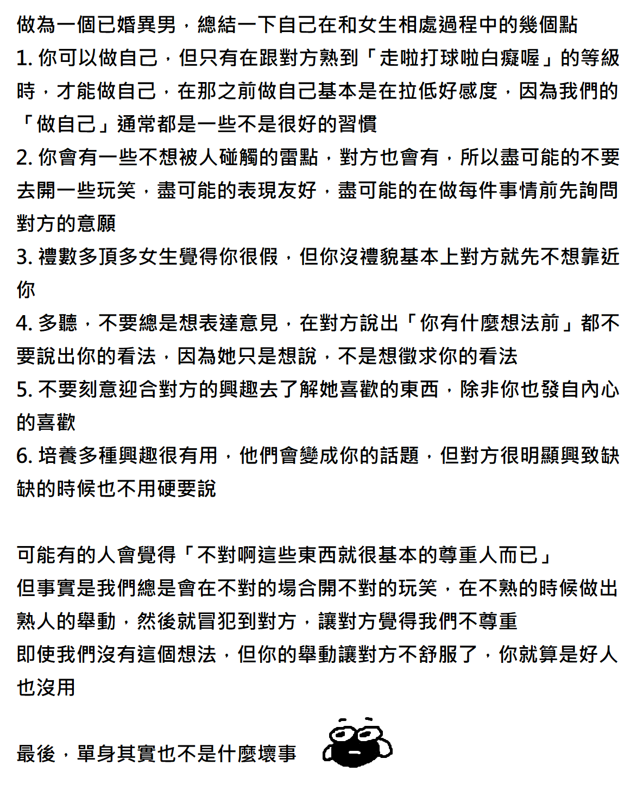

> Learning to love, properly
<!-- toc -->

## Context

- A significant node in my knowledge map

## Notes

> One sentence summary: love *in the way* that *the person wanted*

### It's Hard

> If you do not think that's true, it might

- because you don't want to trust a random advice from a stranger
- because you two are an unbelievably perfect-fit couple
- or it's just *like*
- or it's just *adore*
- or it's just *sexual desire*
- or a [cynical take](https://www.zhihu.com/question/349923819/answer/1360316873) written by [旅行者一号](https://www.zhihu.com/people/mengyongran)
- or you two hasn't reach the stage of marriage

### Do

> The essential ideas for an *infinite* list

- Be Brave
- Be Open
- Be Sincere
- Be Kind despite Faults
- Be Devoted
- Be in a Long-term Vision
- Be Compromisable
- Be Trustful
- Be Patient
- Not Rush for Progress
- Not Turn Potential Discussion into a *Cold War*
- Consider it requires Continuous Learning
- Consider it's a Learning Experience for the *Self*

### Apology

1. Apologize early
2. Recap where you did wrong
3. Promise How you're gonna make it right from now on

### Continuous Learning

| RESOURCE | NOTES |
| :--- | :--- |
| [我們一定得談戀愛嗎?](https://www.youtube.com/watch?v=bHVKaLFjUo0) on [文森說書](https://www.youtube.com/@vincent_reading/videos) | 👈 Not really a good title 👉 [Love despite faults](https://www.goodreads.com/quotes/267314-you-don-t-love-because-you-love-despite-not-for-the#:~:text=despite%20the%20faults), basically |
| [異男生態觀察：為什麼我們常常在人際關係上卡住?](https://www.youtube.com/watch?v=WYnjNQSFsIQ) | [*图片链接*](https://twitter.com/case32bfk/status/1542895935394844672)  |

----

### Rant

#### Ignorance

> Unless you have an idea about what *Feminism* really is **all about** or **strives for**, you don't know shit about *How to Love*.

#### Slang/Slur

> Fuck everyone that promotes and actively using slangs like [this](https://zh.wikipedia.org/wiki/Category:%E5%AF%B9%E5%A5%B3%E6%80%A7%E7%9A%84%E8%B4%AC%E7%A7%B0) <small>(it's normally a two or three-character word said mostly by males)</small>

- 🖕🖕
- 🖕🖕🖕

-----

## References

### Jike <small>(即刻)</small>

> The link might die. Websites like Jike or Zhihu tries their fucking best for stopping me from archiving their pages but I'll try my best.

- A [post](https://web.okjike.com/originalPost/63aeed05ee7bbb182bf307e0) written by [Yukinana.me](https://web.okjike.com/u/74E9FD45-B575-4DFC-B0C9-523047FE90A9), posted on *一个想法不一定对* <small>(*failed to archive*)</small>

### Anything Else

- [暴躁涤纶 @ZizekButler - 拉康说，爱就是互相交换对方的匮乏](https://twitter.com/ZizekButler/status/1613357022938009600)

-----

> [Esdomera](https://www.etsy.com/shop/Esdomera)
